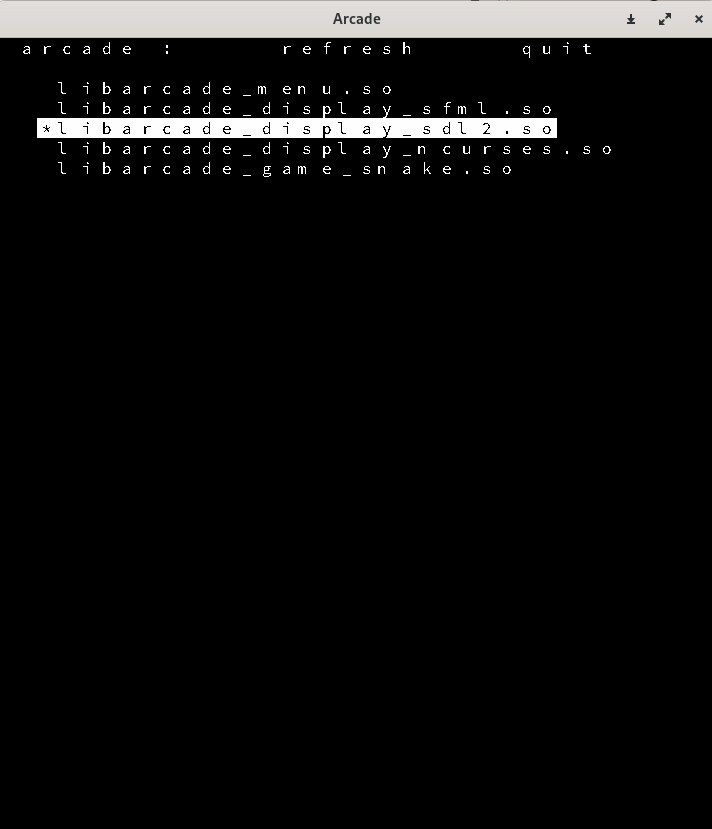

# Arcade project :desktop_computer:

## Done by Melissa, Maxime and Romain - Epitech 2023 :mortar_board:

### Overview

This project is a part of the **second** year of Epitech. <br>
We had **3 weeks** to complete it. :spiral_calendar: <br>

The goal of this project was to create an **Arcade** in **C++** with the **SFML, Ncurses and SDL2 libraries**. :video_game:<br>

### Running the project locally

* Clone this repository locally
* Create a folder `build` at the root of the repository
* Go in it and run the command `cmake ..`
* Then you can do a `make`
* And run `./arcade`

<br>

> **Warning**
> Make sure the Ncurses, SFML and SDL2 libraries are installed or the program won't work.

<br>

To try this program, you can to use this **command** to automatically play the game and when you quit it, clean the repository: <br>

```bash
mkdir -p build && cd build && cmake .. && make && ./arcade
```

An output you can get from this program can be:



To see how you can implement your own game, you can go see that [documentation](doc/DOCUMENTATION.md).

Here are the different **tools** and **languages** we used to make this project: :hammer_and_wrench:

[](https://github.com/tandpfun/skill-icons)

Here is the **GitHub** of the persons who did the project with me : [Maxime Senard](https://github.com/RedCommand), [Romain Delaruelle](https://github.com/FiirePirate)
